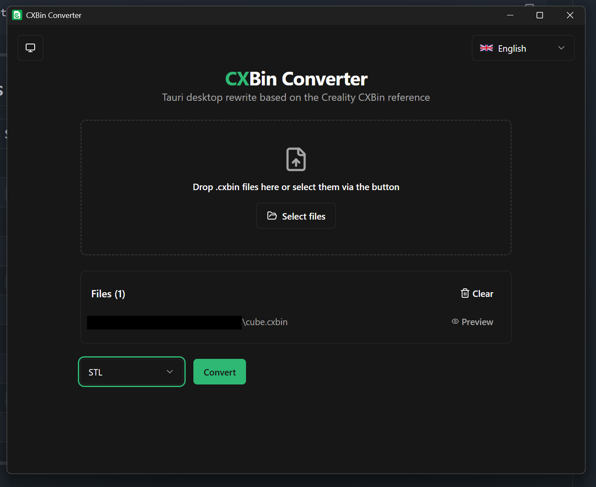
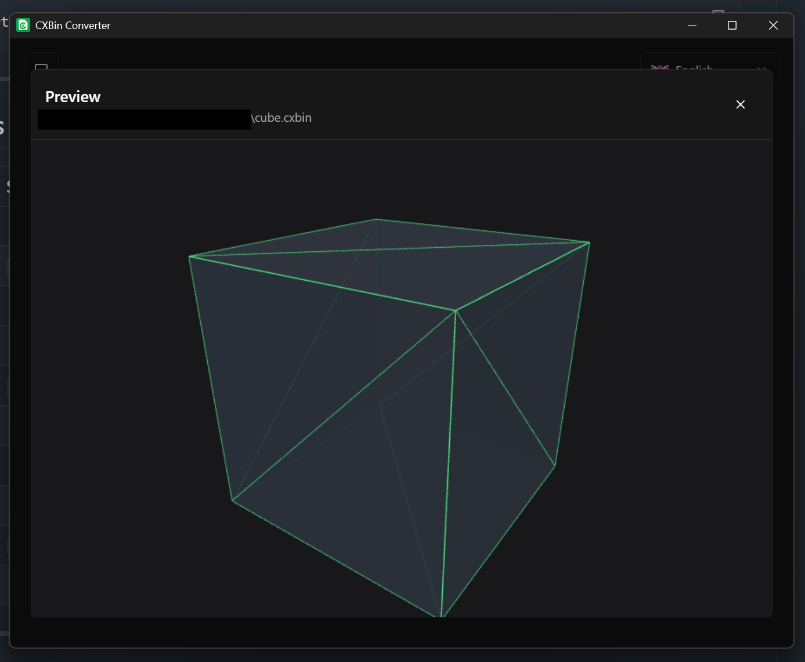
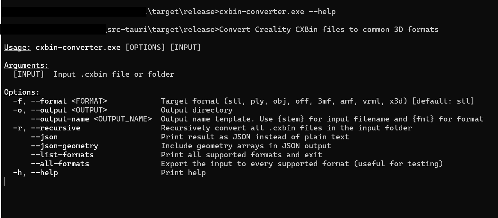

# CXBin Converter – Tauri Rewrite

A powerful Tauri desktop rewrite of the [CXBin-Converter](https://github.com/HellBz/CXBin-Converter/tree/legacy). It reads `.cxbin` files (Creality Model Format) and converts them into common 3D formats. CXBin parsing is based on the official C++ reference implementation from [CrealityOfficial/cxbin](https://github.com/CrealityOfficial/cxbin/tree/version-2.0.0/cxbin).

---

## Features

- Custom Rust backend, compatible with `cxbin::loadCXBin` version 2.0.0
- Export to **STL**, **PLY**, **PLYB**, **XYZ**, **OBJ**, **OFF**, **3MF**, **AMF**, **VRML**, **X3D**, **DAE**, **GLB**, **GLTF**, **VTK**, **MSH**, **DXF**, **FBX** and **USDZ**
- Integrated **3D viewer** with Three.js for quick preview
- **CLI mode** for batch processing, drag & drop onto the EXE and API integration
- **JSON output** with optional geometry arrays
- 3MF files contain an embedded thumbnail
- Multi-file formats (OBJ, GLTF) are automatically exported into a folder
- Multi-language GUI (English, German, French, Spanish, Chinese, Japanese)

---

## Tech Stack

- **Backend:** Rust + Tauri 2.0
- **Frontend:** React 18 + TypeScript + Vite + TailwindCSS + shadcn/ui
- **3D Viewer:** Three.js
- **Parser:** Custom Rust module based on the Creality C++ reference

---

## Screenshots

### Main GUI



### 3D Preview



### CLI Usage



---

## Installation & Start

```bash
git clone https://github.com/HellBz/cxbin_converter.git
cd cxbin_converter
git checkout tauri-rewrite
npm install
npm run tauri:dev
```

---

## Usage

### GUI Mode

```bash
npm run tauri:dev
```

Opens the desktop application with drag & drop, format selection and integrated 3D viewer.

### CLI Mode

```bash
# Minimal
./src-tauri/target/release/cxbin-converter.exe model.cxbin

# Pick a format
./src-tauri/target/release/cxbin-converter.exe model.cxbin --format stl
./src-tauri/target/release/cxbin-converter.exe model.cxbin --format 3mf
./src-tauri/target/release/cxbin-converter.exe model.cxbin --format obj

# Output folder and name
./src-tauri/target/release/cxbin-converter.exe model.cxbin --format ply -o ./exports
./src-tauri/target/release/cxbin-converter.exe model.cxbin --format ply --output-name export_{stem}

# Export to all supported formats at once
./src-tauri/target/release/cxbin-converter.exe model.cxbin --all-formats

# Batch (optionally recursive)
./src-tauri/target/release/cxbin-converter.exe ./input_folder --format stl --recursive

# JSON API
./src-tauri/target/release/cxbin-converter.exe model.cxbin --format obj --json
./src-tauri/target/release/cxbin-converter.exe model.cxbin --format obj --json --json-geometry

# List supported formats
./src-tauri/target/release/cxbin-converter.exe --list-formats
```

Placeholders:
- `{stem}` = filename without extension
- `{fmt}` = target format

### Drag & Drop onto the EXE

Drop a `.cxbin` file onto the compiled EXE to convert it directly using the default format `stl`.

---

## CLI Parameters

| Parameter          | Short | Description |
|--------------------|-------|-------------|
| `input`            |       | Input file or folder |
| `--format`         | `-f`  | Target format (`stl`, `ply`, `plyb`, `xyz`, `obj`, `off`, `3mf`, `amf`, `vrml`, `x3d`, `dae`, `glb`, `gltf`, `vtk`, `msh`, `dxf`, `fbx`, `usdz`) |
| `--output`         | `-o`  | Output folder |
| `--output-name`    |       | Output name, supports `{stem}` and `{fmt}` |
| `--recursive`      | `-r`  | Recurse into subfolders (only for folder input) |
| `--json`           |       | Output results as JSON |
| `--json-geometry`  |       | Include geometry arrays in JSON output |
| `--all-formats`    |       | Export the input to every supported format |
| `--list-formats`   |       | Print supported formats and exit |

---

## Supported Formats

| Format  | Type | Notes |
|---------|------|-------|
| `stl`   | Single file | Binary |
| `ply`   | Single file | ASCII |
| `plyb`  | Single file | Binary PLY |
| `xyz`   | Single file | Point cloud |
| `obj`   | Multi-file | + MTL + texture when available |
| `off`   | Single file | ASCII |
| `3mf`   | Single file | With embedded thumbnail |
| `amf`   | Single file | XML based |
| `vrml`  | Single file | Text based |
| `x3d`   | Single file | XML based |
| `dae`   | Single file | COLLADA |
| `glb`   | Single file | Binary glTF |
| `gltf`  | Multi-file | JSON + BIN folder |
| `vtk`   | Single file | Legacy VTK |
| `msh`   | Single file | Gmsh format |
| `dxf`   | Single file | AutoCAD 3DFACE |
| `fbx`   | Single file | ASCII FBX, geometry only |
| `usdz`  | Single file | Zip with USDA |

---

## Build

### Development

```bash
npm run tauri:dev
```

### Release

```bash
npm run tauri:build
```

The compiled Windows installer is located at:

```
src-tauri/target/release/bundle/
```

---

## Project Structure

```
cxbin-converter/
├── src/                          # React frontend
│   ├── App.tsx
│   ├── components/
│   │   ├── ui/                   # shadcn/ui components
│   │   ├── Viewer.tsx            # Three.js 3D viewer
│   │   ├── LanguageToggle.tsx    # Language selector
│   │   └── flags.tsx             # SVG flags
│   ├── i18n/                     # Translations
│   ├── lib/utils.ts
│   └── main.tsx
├── src-tauri/                    # Rust backend
│   ├── src/
│   │   ├── main.rs
│   │   ├── cli.rs                # CLI mode
│   │   ├── commands.rs           # Tauri commands
│   │   ├── cxbin/                # CXBin parser
│   │   │   ├── mesh.rs
│   │   │   └── reader.rs
│   │   └── export/               # Export modules
│   │       ├── stl.rs
│   │       ├── ply.rs
│   │       ├── ply_binary.rs
│   │       ├── xyz.rs
│   │       ├── obj.rs
│   │       ├── off.rs
│   │       ├── threemf.rs
│   │       ├── amf.rs
│   │       ├── vrml.rs
│   │       ├── x3d.rs
│   │       ├── dae.rs
│   │       ├── glb.rs
│   │       ├── gltf.rs
│   │       ├── vtk.rs
│   │       ├── msh.rs
│   │       ├── dxf.rs
│   │       ├── fbx.rs
│   │       └── usdz.rs
│   └── tauri.conf.json
├── screenshots/                  # UI screenshots
└── README.md
```

---

## Generating Icons

For a complete icon set:

```bash
npm run tauri icon /path/to/logo.svg
```

Currently `src-tauri/icons/icon.ico` is used.

---

## License

MIT License – Free for personal and commercial use.

---

## Author

**Stefan** – Dresden → Karlsruhe  
2025 – Open Source Enthusiast
